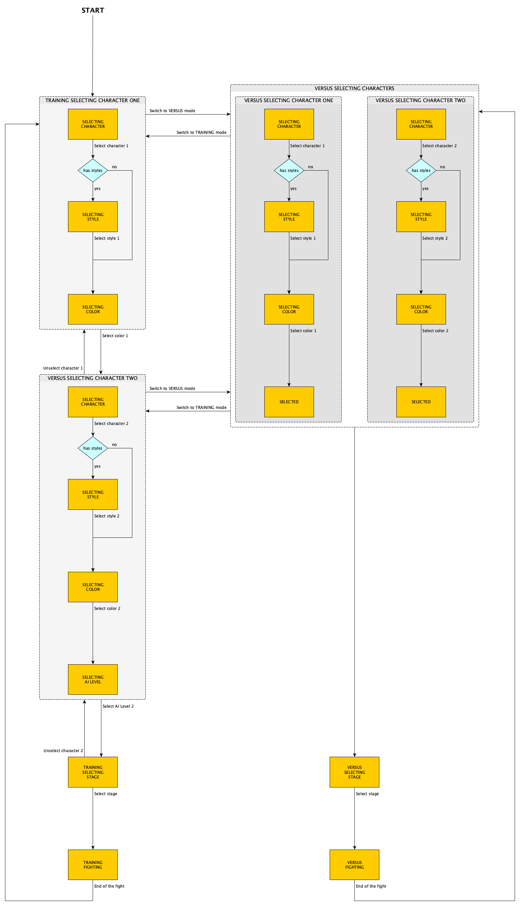

Quick Versus Launcher for MUGEN
===============================

Launch a MUGEN fight without displaying the screenpack.


Features
--------

- Training mode (player versus computer)
- Versus mode (player versus player)
- Organize your characters by category
- Choose the number of columns for your grid
- Scrolling grid
- Random selection for all the characters
- Random selection for category characters
- Custom background image
- Custom sounds
- Select character style
- Select character color
- Select AI level
- Select stage
- Responsive

Navigation
----------

| Button | Description                      |
| ------ | -------------------------------- |
| `A`    | Confirm                          |
| `B`    | Cancel                           |
| `X`    | Previous category                |
| `Y`    | Next category                    |
| `Z`    | Switch mode (Training or Versus) |

Installation
------------

Download [quick-versus.exe](https://github.com/mugen-launcher/quick-versus/releases/latest/download/quick-versus.exe) and put it on the same directory as `mugen.exe`.

Create the file `quick-versus.json`:

```json
{
  "characterColumns": 3,
  "categories": [
    {
      "name": "Street Fighter",
      "image": "Street Fighter/image.png",
      "characters": [
        {
          "definition": "Street Fighter/Ryu/Ryu.def"
        }
      ]
    }
  ],
  "stages": [
    {
      "definition": "Training.def",
      "image": "Training.png"
    }
  ],
  "playerOne": {
    "keyboard": {
      "left": "ArrowLeft",
      "right": "ArrowRight",
      "up": "ArrowUp",
      "down": "ArrowDown",
      "a": "w",
      "b": "x",
      "c": "c",
      "x": "q",
      "y": "s",
      "z": "d",
      "escape": "Escape",
      "enter": "Enter"
    },
    "gamepad": {
      "left": "A17",
      "right": "A18",
      "up": "A19",
      "down": "A20",
      "a": "A0",
      "b": "A1",
      "c": "A7",
      "x": "A2",
      "y": "A3",
      "z": "A6",
      "escape": "A8",
      "enter": "A9"
    }
  },
  "playerTwo": {
    "keyboard": {
      "left": "k",
      "right": "m",
      "up": "o",
      "down": "l",
      "a": "g",
      "b": "h",
      "c": "j",
      "x": "t",
      "y": "y",
      "z": "u",
      "escape": "i",
      "enter": "p"
    },
    "gamepad": {
      "left": "B17",
      "right": "B18",
      "up": "B19",
      "down": "B20",
      "a": "B0",
      "b": "B1",
      "c": "B7",
      "x": "B2",
      "y": "B3",
      "z": "B6",
      "escape": "B8",
      "enter": "B9"
    }
  }
}
```

Characters are organized by category.
Each category has an image (displayed on top of the screen).
For each character, you need to provide the definition path.

Properties
----------

| Name | Description |
| ---- | ----------- |
| `width` | Application width (default: `1024`) |
| `height` | Application height (default: `576`) |
| `fullscreen` | Fullscreen (default: `false`) |
| `frame` | Application with frame (default: `false`) |
| `background` | Image path of the background |
| `sound` | Sound properties (see below) |
| `motif` | Motif name |
| `characterColumns` | Number of columns to display character thumbnails (default: `1`) |
| `characterAnimationOptions.x` | X coordinate for the character animation (default: `47vw`) |
| `characterAnimationOptions.y` | Y coordinate (from bottom) for the character animation (default: `2vh`) |
| `characterAnimationOptions.scaleFactor` | Scale factor for the character animation (default: `1`) |
| `characterNameOptions.x` | Character name x coordinate (default: `40vw`) |
| `categories` | List of categories (see below) |
| `stages` | List of stages (see below) |

Sound properties
----------------

| Name | Description |
| ---- | ----------- |
| `volume` | Sound volume in percent (default: `100`) |
| `background` | File path of the background sound |
| `selectCharacter` | File path of the sound played when selecting a character |
| `selectStyle` | File path of the sound played when selecting the character style |
| `selectColor` | File path of the sound played when selecting the character color |
| `selectAILevel` | File path of the sound played when selecting the AI level |
| `moveCursor` | File path of the sound played when moving the cursor |
| `cancel` | File path of the sound played on cancel |

Category properties
-------------------

| Name | Description |
| ---- | ----------- |
| `characters` | List of characters (see below) |
| `random` | Indicates that the category is a random selection (default: `false`) |

Character properties
--------------------

| Name | Description |
| ---- | ----------- |
| `definition` | Definition file path |
| `styleName` | Style name (default: `Style 1`) |
| `portrait` | Image path of the character portrait (default: `portrait.png`) |
| `portraitOptions.x` | Portrait x coordinate (default: `50vw`) |
| `stand` | Image path of the character stand animation (default: `stand.gif`) |
| `stand2` | Image path of the character stand animation for color 2 (default: `stand2.gif`) |
| `standOptions.x` | Override x coordinate for the character stand animation (default: `47vw`) |
| `standOptions.y` | Override y coordinate for the character stand animation (default: `2vh`) |
| `standOptions.scale` | Set the scale factor of the character stand animation (default: `1`) |
| `thumbnail` | Image path of the character thumbnail (default: `thumbnail.png`) |
| `styles` | Alternative styles. List of characters (default: `[]`) |
| `random` | Indicates that this character is random one within category (default: `false`) |

Stage properties
----------------

| Name | Description |
| ---- | ----------- |
| `definition` | Definition file path |
| `random` | Indicates a random stage (default: `false`) |

Gamepad and keyboard mapping
----------------------------

You can download and execute [gamepad-logger.exe](https://github.com/mugen-launcher/gamepad-logger/releases/latest/download/gamepad-logger.exe) to fill the gamepad and keyboard mapping.

Tutorials
---------

- [How to add a character](./docs/how-to-add-character.md)
- [How to add stand animations from Fighter Factory HTML export](./docs/how-to-add-stand-animations-ff-export.md)
- [How to create stage illustration](./docs/how-to-create-stage-illustration.md)

Application states
------------------



Development
-----------

Requirement:  NodeJS >= 13

Install dependencies with:
```bash
npm ci
```

Launch in dev environment with:
```bash
npm start
```

Launch in MUGEN environment with:
```bash
npm start /path/to/mugen/directory
```

With Auto-Reload:
```bash
npm run start:autoreload-mac
```
