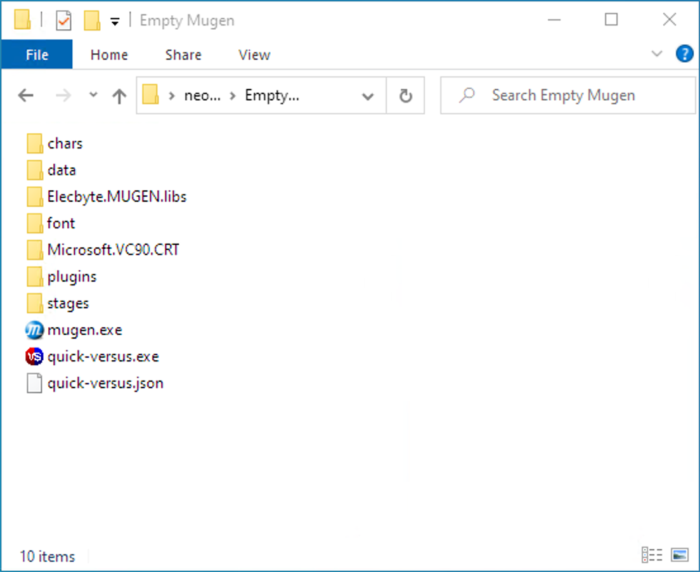
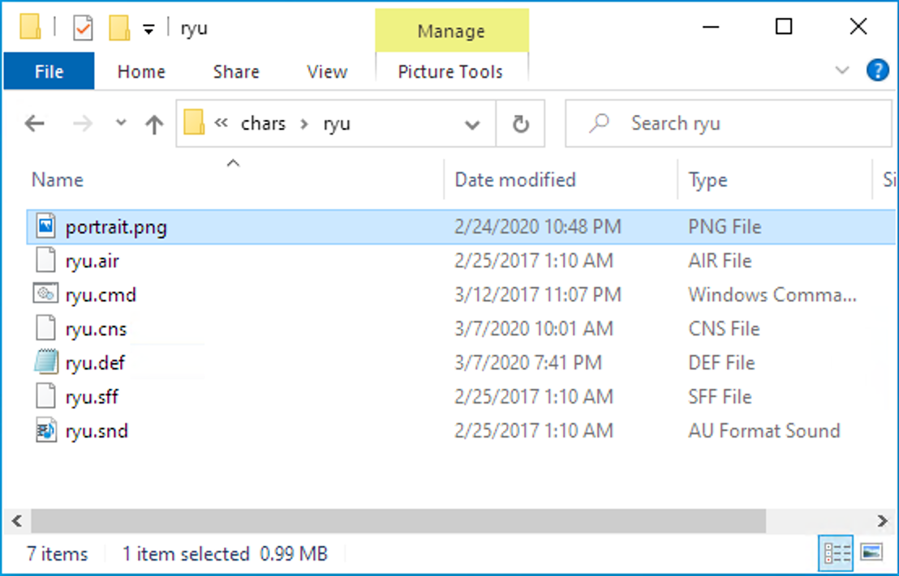
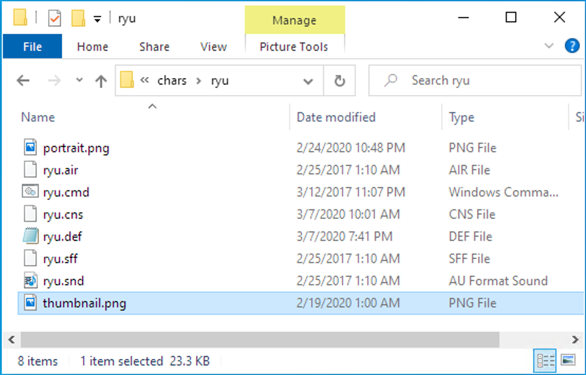

How to add a character
======================

Your MUGEN directory looks like that:




Add your character in the `chars` directory like usual.


Register the character
----------------------

Edit the file `quick-versus.json` and add theses lines in `"catagories"` property:

```json
    {
      "name": "Street Fighter",
      "characters": [
        {
          "definition": "ryu/ryu.def"
        }
      ]
    }
```

Now the file looks like:

```json
{
  "characterColumns": 3,
  "categories": [
    {
      "name": "Street Fighter",
      "characters": [
        {
          "definition": "ryu/ryu.def"
        }
      ]
    }
  ],
  "stages": [],
  "playerOne": {
    "keyboard": {
      "left": "ArrowLeft",
      "right": "ArrowRight",
      "up": "ArrowUp",
      "down": "ArrowDown",
      "a": "w",
      "b": "x",
      "c": "c",
      "x": "q",
      "y": "s",
      "z": "d",
      "escape": "Escape",
      "enter": "Enter"
    },
    "gamepad": {
      "left": "A17",
      "right": "A18",
      "up": "A19",
      "down": "A20",
      "a": "A0",
      "b": "A1",
      "c": "A7",
      "x": "A2",
      "y": "A3",
      "z": "A6",
      "escape": "A8",
      "enter": "A9"
    }
  },
  "playerTwo": {
    "keyboard": {
      "left": "k",
      "right": "m",
      "up": "o",
      "down": "l",
      "a": "g",
      "b": "h",
      "c": "j",
      "x": "t",
      "y": "y",
      "z": "u",
      "escape": "i",
      "enter": "p"
    },
    "gamepad": {
      "left": "B17",
      "right": "B18",
      "up": "B19",
      "down": "B20",
      "a": "B0",
      "b": "B1",
      "c": "B7",
      "x": "B2",
      "y": "B3",
      "z": "B6",
      "escape": "B8",
      "enter": "B9"
    }
  }
}
```

Add the character portrait
--------------------------

Add a file `portrait.png` inside the character directory:



You can use this template to keep the same face size for all your characters: [portrait-template.png](./images/portrait-template.png)

You can also customize the image path:

```json
{
  "definition": "ryu/ryu.def",
  "portrait": "path/to/portrait.png"
}
```

Note: The portrait is optional. Without the file, it simply displays nothing.

Add the character thumbnail
---------------------------

Add a file `thumbnail.png` inside the character directory:



You can use this template to keep the same face size for all your characters: [thumbnail-template.png](./images/thumbnail-template.png)

You can also customize the image path:
```json
{
  "definition": "ryu/ryu.def",
  "thumbnail": "path/to/thumbnail.png"
}
```

Note: The thumbnail is optional. Without the file, it simply displays a placeholder.

Add the character stand animation
---------------------------------

Download and open the definition file with [Fighter Factory Studio](http://fighterfactory.virtualltek.com/)


Go to the `Animation` view and export the stand animation in the character directory as `stand.gif`.

You can also customize the image path:
```json
{
  "definition": "ryu/ryu.def",
  "stand": "path/to/stand.gif"
}
```

Note: The stand animation is optional. Without the file, it simply displays nothing.

